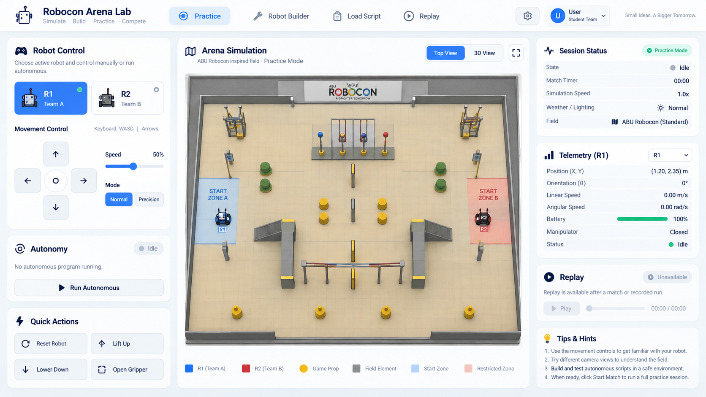

# Robocon Arena Lab — Light Dashboard Implementation Pack

**Prepared:** 2026-09-05  
**Repository:** `ther12k/robocon`  
**Planning baseline:** `f5092ffa5aa8eeb9aaab016dfa4b8a303c14c12a` (`f5092ff`)  
**Status:** proposed implementation plan; no application code or GitHub issues were changed by this package.

## Answer to the design question

**No: the supplied light, three-column dashboard is not implemented in the public revision verified for this plan.** The baseline uses a dark full-screen arena with floating controls. Several underlying simulator capabilities already exist and should be reused. [S02](https://github.com/ther12k/robocon/blob/f5092ffa5aa8eeb9aaab016dfa4b8a303c14c12a/index.html#L9-L99) [S03](https://github.com/ther12k/robocon/blob/f5092ffa5aa8eeb9aaab016dfa4b8a303c14c12a/src/style.css#L1-L36) [S04](https://github.com/ther12k/robocon/blob/f5092ffa5aa8eeb9aaab016dfa4b8a303c14c12a/package.json)

The supplied picture is a **visual target**, not a screenshot of the repository and not evidence of battery simulation, lift mechanics, weather, authentication, official arena geometry or replay seeking. The implementation must preserve its light appearance, layout hierarchy and useful controls without inventing those capabilities.

## Start here

1. Read [Repository Review](REPOSITORY_REVIEW.md) and [PRD](PRD.md).
2. Read [Design Spec](DESIGN_SPEC.md), [Screen Scenarios](SCREEN_SCENARIOS.md) and [State/Capabilities](STATE_AND_CAPABILITIES.md).
3. Use [Task Index](TASK_INDEX.md) and [Epics](EPICS.md) to schedule work.
4. Register the individual `issues/RUI-*.md` files using [GitHub Import](GITHUB_IMPORT.md).
5. Give the coding agent [Agent Handoff](AGENT_HANDOFF.md); completion is governed by [Release Gates](RELEASE_GATES.md).

## Package boundaries

All written deliverables are Markdown. `assets/reference-dashboard.png` is the exact supplied image, included so the brief remains self-contained. The package contains individual issue bodies, technical contracts, acceptance tests, source links and a SHA-256 manifest. Issue IDs such as `RUI-014` are planning IDs, **not existing GitHub issue numbers**.

The mandatory launch track is **RUI-001 through RUI-038**. **RUI-039 through RUI-042 are explicitly deferred** and do not block the light-dashboard release. They concern richer replay controls, lift mechanics, additional simulated telemetry and untrusted-script isolation.

## Design direction

Keep the existing TypeScript/Vite/Three.js/Rapier stack. Add a modular DOM/CSS presentation layer and a small application adapter. Do not rebuild the engine, introduce a server, adopt a new UI framework, or change the replay format merely to reproduce the appearance.

## Evidence limits

Public commit/history views returned inconsistent cached revisions during research. The plan therefore cites immutable `f5092ff` sources rather than claiming an unqualified latest HEAD. The filtered history exposed this newer revision after `6970c5f`. Direct local Git access failed because DNS resolution was unavailable; no local application build, runtime screenshots, or test execution is claimed. Re-baselining is the first issue. See [Source Register](SOURCE_REGISTER.md).
